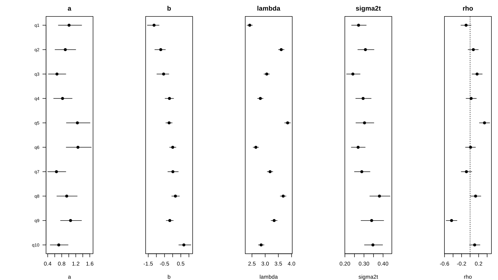
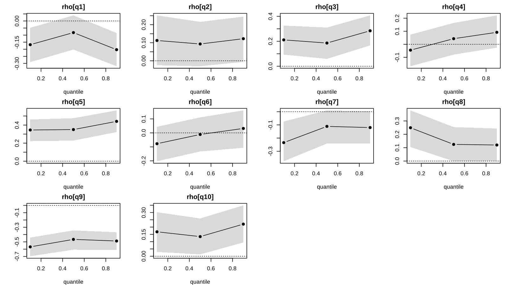

# birtRcpp

**BIvariate Response Time Modeling with 'Rcpp'**

birtRcpp fits joint models of item responses and response times in R, from their full conditionals.
Choose a built-in model (2PL with log-normal response times, latent regressions of ability and
speed, cross-relations of ability with each response time, and their quantile versions) or declare
your own with `block_model()`. The main estimator is `ecm()`: maximum marginal likelihood by ECM,
with standard errors, AIC and BIC, usually in about a second. The same conditional steps drive the
Gibbs sampler `gibbs()` and the variational engine `vi()`, and every draw runs in C++
(RcppArmadillo). The built-in models port the Julia package ExtendedRtIrtModeling.jl with corrected
full conditionals; the Julia function names are kept as aliases.

中文版（完整說明）：[README.zh-TW.md](README.zh-TW.md)

## Installation

```r
# install.packages("remotes")
remotes::install_github("jiewenTsai/birtRcpp")   # from GitHub; needs a C++ compiler
install.packages("birtRcpp")                       # from CRAN, once released
```

A C++ compiler means Rtools on Windows and the Xcode command line tools on macOS.

## Quick start

Four steps: `input_data()`, a model, `ecm()`, and the tables.

```r
library(birtRcpp)
set.seed(1)
cond <- set_cond(n_subj = 500, n_item = 10)
sim  <- sim_data(cond, sim_para(cond, "cross"), "cross")       # simulated responses and seconds
raw  <- data.frame(id = sprintf("P%03d", 1:500), sim$Y, sim$T)  # a data frame as it usually comes
names(raw) <- c("id", paste0("q", 1:10), paste0("q", 1:10, "_sec"))

dat <- input_data(resp = paste0("q", 1:10), time = paste0("q", 1:10, "_sec"), id = "id", data = raw)
fit <- ecm(rtirt_cross(dat))     # logit P(y = 1) = a(θ − b);  log t = λ − ζ − ρθ + ε
fit
```

```
rtirt_cross 
  500 persons x 10 items
  maximum marginal likelihood (ECM, 41 Gauss-Hermite nodes): 14 iterations, 0.8 s
  logLik -8309.032, npar 51, AIC 16720.1, BIC 16935.0
  Reliability: ability 0.746, speed 0.975
Use summary(), coef(), scores(), estimates(), fit_indices(); gibbs(fit, init = "ecm") to sample from here.
```

```r
summary(fit)$items               # one row per item (summary(fit)$se has the standard errors)
```

```
item parameters (ECM estimates) 
item      a       b  lambda  sigma2t     rho
q1    1.013  -1.113   2.415    0.269  -0.091
q2    0.911  -0.711   3.608    0.305   0.077
q3    0.669  -0.533   3.061    0.240   0.163
q4    0.829  -0.192   2.818    0.293   0.026
q5    1.247  -0.215   3.851    0.299   0.338
...
```

```r
head(scores(fit), 3)             # EAP and posterior SD of ability and speed, with the id
```

```
    id    ability ability_psd      speed speed_psd
1 P001 -0.1256462   0.4866794  0.4730123 0.1705656
2 P002 -0.7703921   0.4939586  0.1401154 0.1705812
3 P003 -0.4035749   0.4872747 -1.1086617 0.1705668
```

`input_data()` takes matrices or column names of a data frame; `time` is in seconds (the package
takes the log; use `log_time =` for logged times), `cov` gives centred covariates. It checks the
coding (0/1), missing values, logged times and uncentred covariates, and says what to do.

## Highlights

### 1. ECM first, then Gibbs from the ECM solution

`ecm()` gives estimates, standard errors, `logLik()`, `AIC()`, `BIC()` and likelihood-ratio tests.
`gibbs(fit, init = "ecm")` starts the chains at that solution, so a short burn-in is enough.

```r
f0 <- ecm(rtirt_null(dat))                       # nested: equal rho for every item
lr <- 2 * (logLik(fit) - logLik(f0)); df <- fit$ecm$npar - f0$ecm$npar
c(LR = lr, df = df, p = pchisq(lr, df, lower.tail = FALSE))
#>           LR           df            p 
#> 2.981960e+02 9.000000e+00 6.299468e-59 

g <- gibbs(fit, n_iter = 2000, n_chain = 3, init = "ecm", seed = 1)
g
```

```
rtirt_cross 
  500 persons x 10 items
  3 chains x 2000 iterations (burn-in 1000, thin 1); 9.9 s
  Reliability: ability 0.738, speed 0.970
  Marginal: DIC 16720.6 (pD 51.1), WAIC 16721.3
Use summary(), coef(), scores(), estimates(), convergence(), fit_indices(), plot().
```

```r
estimates(g, pars = "^rho")[1:3, ]     # posterior mean, SD, 95% interval, R-hat, ESS
```

```
  parameter         est         sd        q025       q975     rhat  ess sig
1   rho[q1] -0.09431272 0.06152600 -0.21575375 0.02345701 1.000269 1717    
2   rho[q2]  0.07573443 0.06194121 -0.04765377 0.19324590 1.001074 1765    
3   rho[q3]  0.16385389 0.06161725  0.04517955 0.28550189 1.002219 1666   *
```

```r
convergence(g)
#> 98.0% of 51 parameters with ESS > 400 and R-hat < 1.05
plot(g)                                 # item parameters with 95% intervals; plot(g, "trace") for trace plots
```



| Need | `ecm()` | `gibbs()` |
|---|---|---|
| estimates and SEs | 1-2 s | tens of seconds |
| AIC, BIC, likelihood-ratio test | yes | marginal DIC, WAIC, LOO instead |
| small samples, parameters near a bound | `prior = "map"` | priors regularize |
| quantile (asymmetric Laplace) models | no | yes |
| full uncertainty of derived quantities | Wald | posterior draws |

### 2. The model and the algorithm, written out

`equations()` writes the model with the parameter names of the tables; `algorithm()` lists every
step of the estimator with the prior constants substituted. Both print Unicode and give LaTeX with
`format = "latex"` (an `aligned` block for a paper).

```r
equations(g)
```

```
Measurement:
  logit P(yᵢⱼ = 1) = aᵢ(abilityⱼ − bᵢ)    i ∈ {q1, q2, …, q10}
           log tᵢⱼ = λᵢ − speedⱼ − ρᵢ·abilityⱼ + εᵢⱼ    i ∈ {q1, q2, …, q10}
               εᵢⱼ ∼ N(0, σᵢ²)

Person variables:
  abilityⱼ ∼ N(0, 1)
    speedⱼ ∼ N(0, s)    s = var_speed

Priors:
  aᵢ ∼ N⁺(1, 1)
  bᵢ ∼ N(0, 3²)
  λᵢ ∼ N(0, 10²)
  σᵢ ∼ half-t(3, 1)
  ρᵢ ∼ N(0, 1)
  √s ∼ half-t(3, 1)
```

```r
algorithm(g)          # the full conditionals of one Gibbs iteration, in order (excerpt)
```

```
Step 1. Cross-relations:
  ρᵢ | · ∼ N(mᵢ/pᵢ, 1/pᵢ)    normal regression of the log times on theta
      pᵢ = 1 + Σⱼ wᵢⱼθⱼ²
      mᵢ = Σⱼ wᵢⱼθⱼ(λᵢ − ζⱼ − log tᵢⱼ)

Step 3. Accuracy items:
       ωᵢⱼ | · ∼ PG(1, aᵢ(θⱼ − bᵢ))    draw_omega()
  bᵢ | ω, a, θ ∼ N(mᵢ/pᵢ, 1/pᵢ)    draw_items_pg(): b first
            pᵢ = 1/9 + aᵢ² Σⱼ ωᵢⱼ
            mᵢ = aᵢ Σⱼ (aᵢωᵢⱼθⱼ − κᵢⱼ)
  aᵢ | ω, b, θ ∼ N⁺(mᵢ/pᵢ, 1/pᵢ)    then a (truncated normal)
            pᵢ = 1 + Σⱼ ωᵢⱼ(θⱼ − bᵢ)²
            mᵢ = 1 + Σⱼ κᵢⱼ(θⱼ − bᵢ)
...
Step 9. Cross-relation move:
  (ρᵢ, ζⱼ) ← (ρᵢ − δ, ζⱼ + δθⱼ)    leaves the likelihood unchanged
     δ | · ∼ N(m/p, 1/p)
```

The note on the right of each step names the building block (`draw_*()`) that runs it, so a new
sampler can be composed in R with the same functions (`?blocks`, `inst/examples/ex07_blocks.R`).

### 3. Quantile response-time models

`quantile =` replaces the mean of the log times by a quantile (asymmetric Laplace working
likelihood; Gibbs only). A vector of levels fits one model per level.

```r
qs <- gibbs(rtirt_cross(dat, quantile = c(0.1, 0.5, 0.9)), n_iter = 2000, n_chain = 2, seed = 2)
qs
```

```
rtirt_cross at quantiles 0.1, 0.5, 0.9
parameter   q=0.1   q=0.5   q=0.9
rho[q1]    -0.168  -0.082  -0.203
rho[q2]     0.113   0.093   0.122
rho[q3]     0.211   0.186   0.284
rho[q4]    -0.045   0.043   0.092
rho[q5]     0.345   0.350   0.441
...
  Warning: max R-hat 1.10 > 1.05; see convergence()
```

The chains here are short for the sake of the example (the defaults are `n_iter = 5000`,
`n_chain = 4`); the print warns when R-hat is above 1.05.

```r
plot(qs)              # rho of each item against the quantile level, with 95% intervals
```



### 4. Declare your own model: one declaration, three engines, three checks

`block_model()` declares a model in the style of JAGS or PyMC. A list of steps names the blocks;
the same model and steps go to `ecm()` (conditional maximization), `gibbs()` (conditional draws)
and `vi()` (coordinate-ascent variational inference). Polya-Gamma variables, Jacobians,
truncation and dimensions (`[person]`, `[item]`) are handled for you.

```r
set.seed(11)
N <- 500; K <- 10
a_true <- seq(0.6, 2, length.out = K); b_true <- seq(-2.5, 2.5, length.out = K)
theta_true <- rnorm(N)
Y <- matrix(rbinom(N * K, 1, plogis(sweep(outer(theta_true, a_true), 2, a_true * b_true))), N, K)

m <- block_model(Y = Y,
  theta[person] ~ normal(0, 1),
  a[item] ~ normal(1, 1, lower = 0),
  b[item] ~ normal(0, 3),
  Y ~ bernoulli_logit(a * (theta - b)))
m
```

```
Data (j = person, N = 500; i = item, K = 10):
  logit P(Yⱼᵢ = 1) = aᵢ(θⱼ − bᵢ)

Priors:
  θⱼ ∼ N(0, 1)
  aᵢ ∼ N⁺(1, 1)
  bᵢ ∼ N(0, 9)
```

```r
steps <- list(step_mala(a, b), step_gibbs(theta, a, b), step_shift(theta = 1, b = 1))
fit_e <- ecm(m, steps)                             # posterior mode and SEs (prior = "ml" for ML)
fit_g <- gibbs(m, steps, n_iter = 2000, seed = 1)  # posterior draws
fit_v <- vi(m, list(step_gibbs(theta, a, b)))      # CAVI: one factor q per block
fit_e
```

```
ECM for the declared model: converged after 18 iterations (2 rounds of the grid), log posterior -2408.0951
 parameter    est     se
      a[1]  0.500 0.1357
      a[2]  0.794 0.1653
      a[3]  0.939 0.1675
...
      b[9]  1.849 0.1911
     b[10]  2.527 0.3394
```

The three engines on the discriminations (`true` is the simulated value):

```
 parameter  true   ecm ecm_se gibbs gibbs_sd    vi vi_sd
      a[1] 0.600 0.500  0.136 0.484    0.125 0.497 0.032
      a[2] 0.756 0.794  0.165 0.756    0.185 0.789 0.048
      a[3] 0.911 0.939  0.168 0.936    0.174 0.931 0.065
      a[4] 1.067 1.049  0.179 1.036    0.177 1.040 0.071
      a[5] 1.222 1.038  0.164 1.031    0.168 1.022 0.096
      ...
```

The CAVI means sit next to the posterior means; its SDs are too small, as for any mean-field
approximation, and `vi()` says so. Each engine has a check that it does what it claims:

```r
check_ecm(m, steps)                   # every step raises the objective, Fisher identity, a maximum
check_sampler(m, steps = steps)       # Geweke (2004) joint distribution test; method = "sbc" for SBC
check_vi(m)                           # the ELBO never decreases and the fit is a maximum
```

```
ECM check (10 starting values): all checks passed
                                                                            check    worst limit passed
                                        each step raises Q(. | x) (relative drop) 0.00e+00 1e-08   TRUE
                         one iteration never lowers the objective (relative drop) 0.00e+00 1e-08   TRUE
 Fisher identity: gradient of the objective = gradient of Q (relative difference) 1.09e-10 1e-04   TRUE
                   ECM stops at a maximum: gain of a general optimizer (relative) 1.53e-14 1e-06   TRUE
                                       ECM stops at a maximum: largest |gradient| 7.86e-05 1e-02   TRUE
```

A declared response-time model reproduces the built-in one. Speed enters only normal parts
linearly, so `ecm()` integrates it exactly and uses quadrature for ability alone:

```r
mrt <- block_model(Y = unname(sim$Y), logT = unname(sim$log_t),
  theta[person] ~ normal(0, 1),
  zeta[person] ~ normal(0, sqrt(v)),
  v ~ half_t(3, 1),
  a[item] ~ normal(1, 1, lower = 0),
  b[item] ~ normal(0, 3),
  lambda[item] ~ normal(0, 10),
  rho[item] ~ normal(0, 1),
  sigma2[item] ~ half_t(3, 1),
  Y ~ bernoulli_logit(a * (theta - b)),
  logT ~ normal(lambda - zeta - rho * theta, sqrt(sigma2)))
c(builtin = as.numeric(logLik(fit)), declared = ecm(mrt, prior = "ml")$loglik)
#>   builtin  declared 
#> -8309.032 -8309.032 
```

`step_gibbs(theta, cut = "logT")` gives a cut (the times never feed back into ability), and
`score_test(fit_e, add = Y ~ delta[item] * z)` tests an added term from the null fit alone.

### 5. Tests from one fit

```r
group <- rbinom(500, 1, 0.5) == 1         # a grouping or continuous moderator (gender, position, total time, ...)
score_test(fit, group, by_item = TRUE)    # score-based test of parameter invariance (DIF), per item with Holm
```

```
Score-based test of parameter invariance (LM test, factor with 2 levels moderator, block decorrelation)
 parameters  n statistic p.value p.holm
   accuracy 20    15.458   0.750       
         q1  2     1.189   0.552      1
         q2  2     2.282   0.319      1
...
```

```r
ci_test(fit)                              # conditional independence of responses and times (LM test)
#> Conditional independence of responses and response times (van der Linden & Glas, 2010)
#>   all items: LM = 13.22, df = 10, p = 0.211
person_fit(g)                             # response-time person fit (Marianti et al., 2014), from a Gibbs fit
preknowledge_test(fit, compromised = c("q1", "q2"))   # item preknowledge statistics (Sinharay, 2020)
```

`score_test()` also returns the casewise scores through `estfun()`, so the fit can go straight
into strucchange or partykit.

### 6. Priors, MAP and a faster sampler

```r
rtirt_priors(a = c(mean = 1, sd = 0.5), rho = c(sd = 0.3))        # the Prior column of summary() shows them
ecm(rtirt_cross(dat), prior = "map", priors = rtirt_priors(a = c(1, 0.5)))   # posterior mode in the item parameters
gibbs(fit, init = "ecm", collapse = TRUE)                           # partially collapsed Gibbs: same posterior, higher ESS
```

```
Priors (gibbs(); item parameters also for ecm(prior = "map")):
  a          N+(1, 0.5^2)
  b          N(0, 3^2)
  lambda     N(0, 10^2)
  sigma2t    SD ~ half-t(3, 1)
  beta       N(0, 1)
  rho        N(0, 0.3^2)
  var_speed  SD ~ half-t(3, 1)
  cov        N(0, 1)
```

The defaults are common data-independent priors and every full conditional stays conjugate.
`collapse = TRUE` integrates speed and the Polya-Gamma variables out of the slow updates: on the
example above the effective sample size of the discriminations goes from 318-1099 to 939-1447
with the same number of iterations.

## Built-in models

| constructor | model |
|---|---|
| `mlirt(dat)` | 2PL (or 1PL) with a latent regression of ability |
| `rtirt_null(dat)` | 2PL + log-normal response times, ability and speed correlated (van der Linden, 2007) |
| `rtirt_latreg(dat)` | ... with latent regressions of ability and speed on covariates |
| `rtirt_latent(dat)` | speed regressed on ability and covariates; `quantile =` for quantile regression |
| `rtirt_cross(dat)` | a cross-relation of ability with each log response time; `quantile =` |

All five are fitted by `ecm()` or `gibbs()`; the quantile versions by `gibbs()` only. The
accessors `summary()`, `coef()`, `estimates()`, `scores()`, `reliability()`, `convergence()`,
`fit_indices()` and `plot()` work on both kinds of fit.

## Documentation

- `vignette("birtRcpp")`: getting started.
- Two tutorials in `inst/tutorial/` (Traditional Chinese, every line and output explained):
  `birtRcpp_intro.qmd` (the built-in models) and `birtRcpp_blocks.qmd` (declaring models and
  composing samplers and EM algorithms).
- `system.file("examples", package = "birtRcpp")`: 13 scripts, from the quick start to testlet,
  multidimensional, LNIRT, variable-speed and preknowledge models composed from the blocks.
- [birtExamples](https://github.com/jiewenTsai/birtExamples): tutorials and examples.
- [README.zh-TW.md](README.zh-TW.md): the full description in Chinese, with the Julia-to-R name
  table, the corrections to the Julia samplers and the validation against Julia and JAGS.

## References

Meng, X.-L., & Rubin, D. B. (1993). Maximum likelihood estimation via the ECM algorithm: A general
framework. *Biometrika, 80*, 267-278.

Polson, N. G., Scott, J. G., & Windle, J. (2013). Bayesian inference for logistic models using
Polya-Gamma latent variables. *Journal of the American Statistical Association, 108*, 1339-1349.

van der Linden, W. J. (2007). A hierarchical framework for modeling speed and accuracy on test
items. *Psychometrika, 72*, 287-308.
